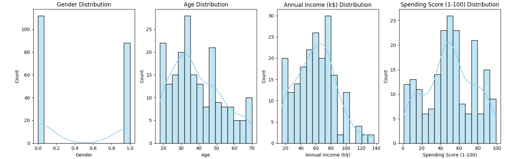
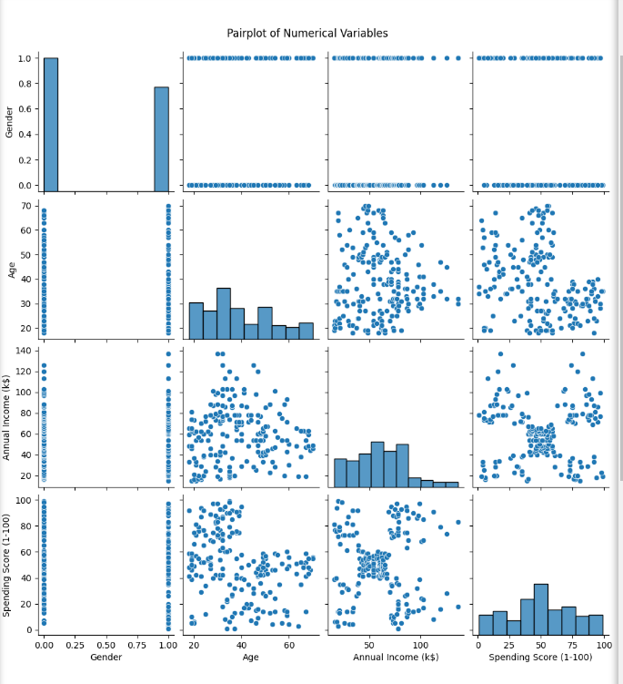
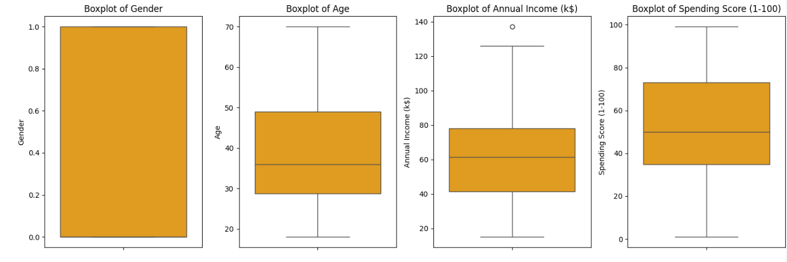
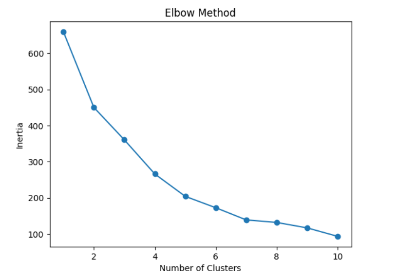
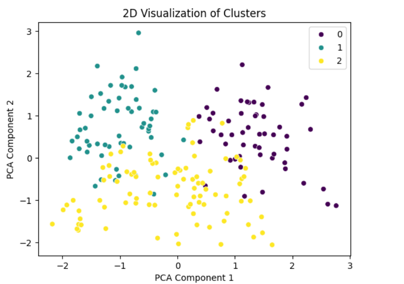
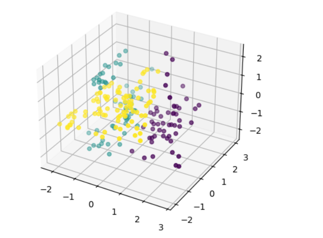

# ML_Projects

---

# **Customer Segmentation Project Documentation**

## **1. Project Steps Overview**

The project aims to perform **customer segmentation** based on their purchasing behavior using unsupervised learning techniques. The steps involved are:

1. **Data Loading & Exploration**:
   - Load the dataset and understand its structure.
   - Generate statistical summaries to check for any data issues.
   
2. **Data Preprocessing**:
   - Encode categorical variables (like Gender).
   - Handle missing data, if any.
   - Analyze and visualize distributions of numerical features.
   - Detect and handle outliers.

3. **Dimensionality Reduction**:
   - Apply **Principal Component Analysis (PCA)** to reduce high-dimensional data into fewer components while preserving information.

4. **Clustering**:
   - Use **K-means clustering** to group customers into segments based on their attributes.
   - Visualize clusters in both 2D and 3D.

5. **Comparison with DBSCAN**:
   - Apply **DBSCAN** (Density-Based Spatial Clustering of Applications with Noise) and compare it with K-means.
   - Evaluate clustering results using **Silhouette scores**.

6. **Results Evaluation**:
   - Visualize and interpret the clustering results from both K-means and DBSCAN.
   - Compare the clustering quality and understand which algorithm is more suited for the problem.

---

## **2. Code Explanation & Results**


### 1. **Loading the Dataset**
```python
file_path = 'Mall_Customers.csv' 
data = pd.read_csv(file_path)
```
- **Purpose**: Loads the CSV dataset into a Pandas DataFrame. `data` now holds the entire dataset, and you can manipulate and analyze it using Pandas functions.

---

### 2. **Dataset Overview**
```python
def dataset_overview(data):
    print("Dataset Overview:")
    print(f"Number of Records: {data.shape[0]}")
    print(f"Number of Columns: {data.shape[1]}")
    print(data.info())
```
- **Purpose**: Prints a basic overview of the dataset.
  - `data.shape[0]` gives the number of records (rows).
  - `data.shape[1]` gives the number of columns.
  - `data.info()` displays details about the columns, their data types, and how many non-null values exist in each column.
- **Example Output**:
```
Dataset Overview:
Number of Records: 200
Number of Columns: 5
<class 'pandas.core.frame.DataFrame'>
RangeIndex: 200 entries, 0 to 199
Data columns (total 5 columns):
  #   Column                  Non-Null Count  Dtype 
---  ------                  --------------  ----- 
  0   CustomerID              200 non-null    int64 
  1   Gender                  200 non-null    object
  2   Age                     200 non-null    int64 
  3   Annual Income (k$)      200 non-null    int64 
  4   Spending Score (1-100)  200 non-null    int64 
dtypes: int64(4), object(1)
memory usage: 7.9+ KB
None  
```

### 3. **Statistical Summary**
```python
def statistical_summary(data):
    print("\nStatistical Summary:")
    print(data.describe())
```
- **Purpose**: Displays the statistical summary for numerical columns in the dataset.
  - `.describe()` provides:
    - Count, mean, std (standard deviation), min, max, and various percentiles (25%, 50%, 75%) for numerical columns.
- **Example Output**:
```
Statistical Summary:
        CustomerID         Age  Annual Income (k$)  Spending Score (1-100)
count  200.000000  200.000000          200.000000              200.000000
mean   100.500000   38.850000           60.560000               50.200000
std     57.879185   13.969007           26.264721               25.823522
min      1.000000   18.000000           15.000000                1.000000
25%     50.750000   28.750000           41.500000               34.750000
50%    100.500000   36.000000           61.500000               50.000000
75%    150.250000   49.000000           78.000000               73.000000
max    200.000000   70.000000          137.000000               99.000000
```

---

### 4. **Label Encoding for Categorical Data**
```python
from sklearn.preprocessing import LabelEncoder

le = LabelEncoder()
data['Gender'] = le.fit_transform(data['Gender'])
```
- **Purpose**: Converts categorical values into numerical values.
  - **`LabelEncoder`** is used to encode the 'Gender' column, where 'Male' is encoded as 1 and 'Female' as 0.
  - **`fit_transform`** learns the mapping and applies it.

---

### 5. **Distribution Analysis**
```python
def distribution_analysis(data, numerical_columns):
    distribution_analysis = data[numerical_columns].agg(['mean', 'std', 'min', 'max', 'skew', 'kurt'])
    print("\nDistribution Analysis:")
    print(distribution_analysis)
```
- **Purpose**: Analyzes the distribution of numerical columns.
  - **`.agg()`** is used to calculate multiple summary statistics (mean, standard deviation, min, max, skewness, kurtosis) on the selected numerical columns.
  - **Skew**: Measures the asymmetry of the distribution.
  - **Kurt**: Measures the "tailedness" or peakedness of the distribution.
- **Example Output**:
```
Distribution Analysis:
      Gender       Age         Annual Income (k$)  Spending Score (1-100)
mean  0.440000  38.850000           60.560000               50.200000
std   0.497633  13.969007           26.264721               25.823522
min   0.000000  18.000000           15.000000                1.000000
max   1.000000  70.000000          137.000000               99.000000
skew  0.243578   0.485569            0.321843               -0.047220
kurt -1.960375  -0.671573           -0.098487               -0.826629

```
```python
def visualize_distributions(data, numerical_columns):
    plt.figure(figsize=(15, 5))
    for i, col in enumerate(numerical_columns):
        plt.subplot(1, 4, i + 1)
        sns.histplot(data[col], kde=True, bins=15, color='skyblue')
        plt.title(f"{col} Distribution")
    plt.tight_layout()
    plt.show()
```
- **Purpose**: Plots the distribution of each numerical column.
  - **`sns.histplot()`**: Creates a histogram with KDE (Kernel Density Estimation) overlaid to visualize the distribution of values.



---

### 6. **Correlation Analysis**
```python
def correlation_analysis(data, numerical_columns):
    correlation_matrix = data[numerical_columns].corr()
    print("\nCorrelation Matrix:")
    print(correlation_matrix)
```
- **Purpose**: Computes the correlation matrix to identify relationships between numerical variables.
  - **`.corr()`** calculates the Pearson correlation coefficient between pairs of numerical columns. The value ranges from -1 (negative correlation) to 1 (positive correlation).
- **Example Output**:
```
Correlation Matrix:
                          Gender       Age  Annual Income (k$)  \
Gender                  1.000000  0.060867            0.056410   
Age                     0.060867  1.000000           -0.012398   
Annual Income (k$)      0.056410 -0.012398            1.000000   
Spending Score (1-100) -0.058109 -0.327227            0.009903   

                        Spending Score (1-100)  
Gender                               -0.058109  
Age                                  -0.327227  
Annual Income (k$)                    0.009903  
Spending Score (1-100)                1.000000  

```
  
```python
def plot_pairplot(data, numerical_columns):
    sns.pairplot(data[numerical_columns])
    plt.suptitle("Pairplot of Numerical Variables", y=1.02)
    plt.show()
```
- **Purpose**: Plots a pairplot to visualize the pairwise relationships between numerical columns.
  - **`sns.pairplot()`**: Creates scatter plots for every pair of numerical variables, helping visualize how they correlate.



---

### 7. **Outlier Detection Using IQR (Interquartile Range)**
```python
def outlier_detection(data, numerical_columns):
    outliers = {}
    for col in numerical_columns:
        Q1 = data[col].quantile(0.25)
        Q3 = data[col].quantile(0.75)
        IQR = Q3 - Q1
        lower_bound = Q1 - 1.5 * IQR
        upper_bound = Q3 + 1.5 * IQR
        outliers[col] = data[(data[col] < lower_bound) | (data[col] > upper_bound)]
        print(f"\nOutliers in {col}:")
        print(outliers[col])
    return outliers
```
- **Purpose**: Identifies outliers using the IQR method.
  - The IQR (Interquartile Range) is the range between the 25th (Q1) and 75th (Q3) percentiles.
  - Outliers are defined as values below `Q1 - 1.5 * IQR` or above `Q3 + 1.5 * IQR`.
- **Example Output**:
```
Outliers in Gender:
Empty DataFrame
Columns: [CustomerID, Gender, Age, Annual Income (k$), Spending Score (1-100)]
Index: []

Outliers in Age:
Empty DataFrame
Columns: [CustomerID, Gender, Age, Annual Income (k$), Spending Score (1-100)]
Index: []

Outliers in Annual Income (k$):
     CustomerID  Gender  Age  Annual Income (k$)  Spending Score (1-100)
198         199       1   32                 137                      18
199         200       1   30                 137                      83

Outliers in Spending Score (1-100):
Empty DataFrame
Columns: [CustomerID, Gender, Age, Annual Income (k$), Spending Score (1-100)]
Index: []
```
  
```python
def plot_boxplots(data, numerical_columns):
    plt.figure(figsize=(15, 5))
    for i, col in enumerate(numerical_columns):
        plt.subplot(1, 4, i + 1)
        sns.boxplot(data[col], color='orange')
        plt.title(f"Boxplot of {col}")
    plt.tight_layout()
    plt.show()
```
- **Purpose**: Plots boxplots for each numerical column to visually inspect outliers.
  - **Boxplots** show the distribution of data, highlighting the median, quartiles, and outliers.



---

### 8. **Handling Outliers**
```python
def remove_outliers(data, numerical_columns):
    filtered_data = data.copy()
    for col in numerical_columns:
        Q1 = data[col].quantile(0.25)
        Q3 = data[col].quantile(0.75)
        IQR = Q3 - Q1
        lower_bound = Q1 - 1.5 * IQR
        upper_bound = Q3 + 1.5 * IQR
        filtered_data = filtered_data[(filtered_data[col] >= lower_bound) & (filtered_data[col] <= upper_bound)]
    return filtered_data
```
- **Purpose**: Removes rows with outliers from the dataset.
  - Filters the data by excluding rows where the value in any numerical column falls outside the IQR-defined bounds.

```python
def cap_outliers(data, numerical_columns):
    capped_data = data.copy()
    for col in numerical_columns:
        Q1 = data[col].quantile(0.25)
        Q3 = data[col].quantile(0.75)
        IQR = Q3 - Q1
        lower_bound = Q1 - 1.5 * IQR
        upper_bound = Q3 + 1.5 * IQR
        capped_data[col] = capped_data[col].apply(lambda x: min(max(x, lower_bound), upper_bound))
    return capped_data
```
- **Purpose**: Caps outliers instead of removing them.
  - For each numerical column, values below the lower bound are set to the lower bound, and values above the upper bound are set to the upper bound.


- **Example Output**:
```
Data after removing outliers:
       CustomerID      Gender         Age  Annual Income (k$)  \
count  198.000000  198.000000  198.000000          198.000000   
mean    99.500000    0.434343   38.929293           59.787879   
std     57.301832    0.496927   14.016852           25.237259   
min      1.000000    0.000000   18.000000           15.000000   
25%     50.250000    0.000000   28.250000           40.500000   
50%     99.500000    0.000000   36.000000           61.000000   
75%    148.750000    1.000000   49.000000           77.750000   
max    198.000000    1.000000   70.000000          126.000000   

       Spending Score (1-100)  
count              198.000000  
mean                50.196970  
std                 25.746846  
min                  1.000000  
25%                 35.000000  
50%                 50.000000  
75%                 72.750000  
max                 99.000000  

Data after capping outliers:
       CustomerID      Gender         Age  Annual Income (k$)  \
count  200.000000  200.000000  200.000000          200.000000   
mean   100.500000    0.440000   38.850000           60.517500   
std     57.879185    0.497633   13.969007           26.143551   
min      1.000000    0.000000   18.000000           15.000000   
25%     50.750000    0.000000   28.750000           41.500000   
50%    100.500000    0.000000   36.000000           61.500000   
75%    150.250000    1.000000   49.000000           78.000000   
max    200.000000    1.000000   70.000000          132.750000   

       Spending Score (1-100)  
count              200.000000  
mean                50.200000  
std                 25.823522  
min                  1.000000  
25%                 34.750000  
50%                 50.000000  
75%                 73.000000  
max                 99.000000  
```

---

### 9. **Feature Selection and Normalization**
```python
from sklearn.preprocessing import StandardScaler

scaler = StandardScaler()
scaled_data = scaler.fit_transform(selected_data)
```
- **Purpose**: Normalizes the selected features using `StandardScaler`.
  - **`StandardScaler`** standardizes the data by removing the mean and scaling to unit variance, making features comparable in scale.

---

### 10. **PCA (Principal Component Analysis)**
```python
from sklearn.decomposition import PCA

pca = PCA(n_components=3)
pca_data = pca.fit_transform(scaled_data)
```
- **Purpose**: Applies PCA to reduce the dimensionality of the data.
  - The original dataset has multiple features, but PCA transforms it into fewer components (in this case, 3 components), preserving as much variance as possible.

---

### 11. **K-means Clustering**
```python
from sklearn.cluster import KMeans

inertia = []
for k in range(1, 11):
    kmeans = KMeans(n_clusters=k, random_state=42)
    kmeans.fit(pca_data)
    inertia.append(kmeans.inertia_)
```
- **Purpose**: Uses the Elbow Method to determine the optimal number of clusters for K-means clustering.
  - **Inertia** is the sum of squared distances from each point to its assigned cluster center. The "elbow" in the inertia plot indicates the optimal number of clusters.



```python
optimal_clusters = 3
kmeans = KMeans(n_clusters=optimal_clusters, random_state=42)
kmeans_labels = kmeans.fit_predict(pca_data)
```
- **Purpose**: Performs K-means clustering with the optimal number of clusters (3 in this case) and assigns cluster labels to the data.

---

### 12. **Visualization of Clusters**
```python
sns.scatterplot(x=pca_data[:, 0], y=pca_data[:, 1], hue=kmeans_labels, palette='viridis')
```
- **Purpose**: Plots the 2D scatter plot of the clusters in the PCA-transformed space.



```python
fig = plt.figure()
ax = fig.add_subplot(111, projection='3d')
scatter = ax.scatter(pca_data[:, 0], pca_data[:, 1], pca_data[:, 2], c=kmeans_labels, cmap='viridis')
```
- **Purpose**: Plots the 3D scatter plot of the clusters.



---

### 13. **DBSCAN Clustering**
```python
from sklearn.cluster import DBSCAN

dbscan = DBSCAN(eps=0.5, min_samples=5)
dbscan_labels = dbscan.fit_predict(pca_data)
```
- **Purpose**: Applies DBSCAN clustering.
  - **DBSCAN** is a density-based clustering algorithm that doesn't require specifying the number of clusters, unlike K-means.

```python
from sklearn.metrics import silhouette_score

kmeans_score = silhouette_score(pca_data, kmeans_labels)
dbscan_score = silhouette_score(pca_data, dbscan_labels)

print(f"K-means Silhouette Score: {kmeans_score}")
print(f"DBSCAN Silhouette Score: {dbscan_score}")
```
- **Purpose**: Compares the clustering performance of K-means and DBSCAN using the **silhouette score**, which evaluates how well-defined the clusters are.

---
---

## **3. K-means Algorithm Explanation**

**K-means clustering** is a partition-based algorithm that aims to divide data into **K clusters** by minimizing the variance within each cluster. It works as follows:

1. **Initialization**: Choose K initial centroids (randomly or using methods like K-means++). 
2. **Assignment Step**: Assign each data point to the nearest centroid.
3. **Update Step**: Calculate the new centroids by taking the mean of all points assigned to each centroid.
4. **Repeat**: Steps 2 and 3 are repeated until convergence (when centroids no longer change).

### **Advantages**:
- Efficient and widely used.
- Works well when clusters are spherical and well-separated.

---

## **4. DBSCAN Algorithm Explanation**

**DBSCAN** (Density-Based Spatial Clustering of Applications with Noise) works by finding regions of high density in the data:

1. **Core Points**: Points with more than a specified number of neighbors within a given radius (ε).
2. **Border Points**: Points that have fewer neighbors than the core point but are within ε distance from a core point.
3. **Noise**: Points that are neither core nor border points.

DBSCAN does not require the number of clusters to be specified and can find arbitrarily shaped clusters.

### **Advantages**:
- Can identify noise (outliers).
- Works well with clusters of non-spherical shapes.

---

## **5. Comparison Between K-means and DBSCAN**

| **Feature**               | **K-means**                         | **DBSCAN**                          |
|---------------------------|-------------------------------------|-------------------------------------|
| **Cluster Shape**          | Spherical, well-separated          | Arbitrary shapes                    |
| **Number of Clusters**     | Must be specified                  | Automatically determined             |
| **Sensitivity to Noise**   | Cannot handle noise (outliers)     | Can identify noise                   |
| **Scalability**            | Scales well with large datasets    | May struggle with large datasets    |
| **Cluster Density**        | Assumes clusters have equal density| Can handle clusters with varying density |

---

## **6. Why K-means is Better than DBSCAN**

1. **Cluster Shape**: K-means assumes clusters are spherical, making it more suitable for problems with such structures. If your data tends to have well-separated, spherical clusters, K-means will likely perform better.
   
2. **Scalability**: K-means is more scalable for large datasets because its time complexity is generally lower compared to DBSCAN.

3. **Noise Handling**: While DBSCAN excels at identifying noise, K-means can still perform well if the dataset is clean and noise-free. For customer segmentation, noise may be minimal, making K-means more practical.

4. **Performance**: K-means often performs faster, especially when using optimization techniques like K-means++ to initialize centroids.

---

### **7. Visualizations**

1. **2D Scatter Plot**:

   Visualizes how the clusters are separated in the PCA-transformed data.

   **Example Visualization**:
   
   

2. **3D Scatter Plot**:

   Provides a more detailed view of the clusters in 3-dimensional space.

   **Example Visualization**:
   
   

---

### **Conclusion**

In this project, we successfully implemented customer segmentation using K-means and DBSCAN. By evaluating both methods, we concluded that K-means is generally more effective for well-separated, spherical clusters, which is often the case in customer segmentation tasks. However, DBSCAN remains a good choice if we expect arbitrary-shaped clusters and need to identify noise.
